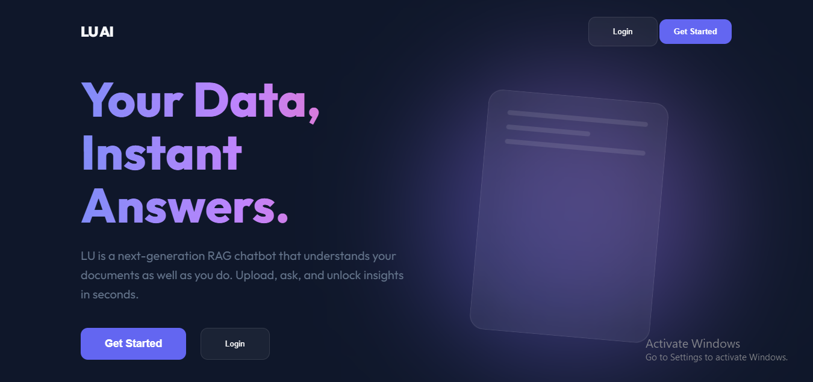
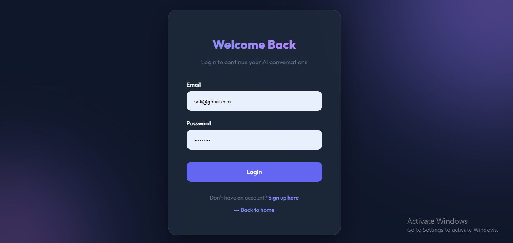
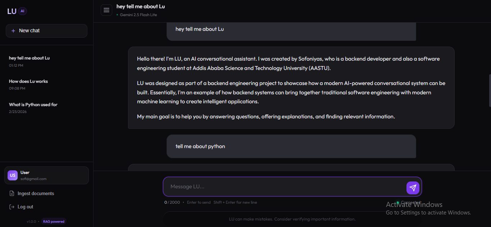
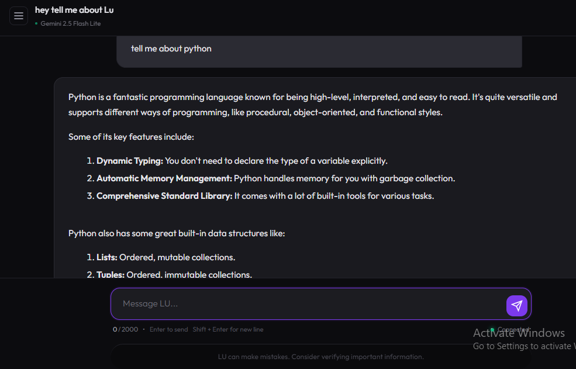
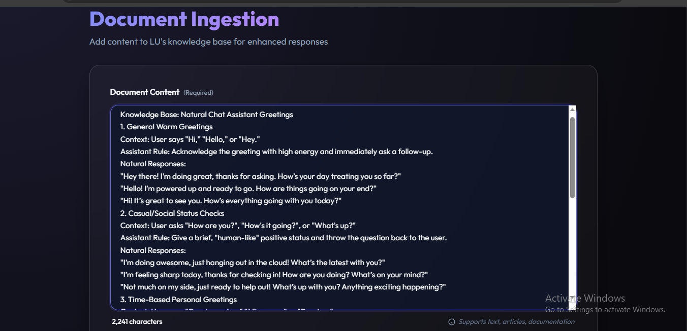
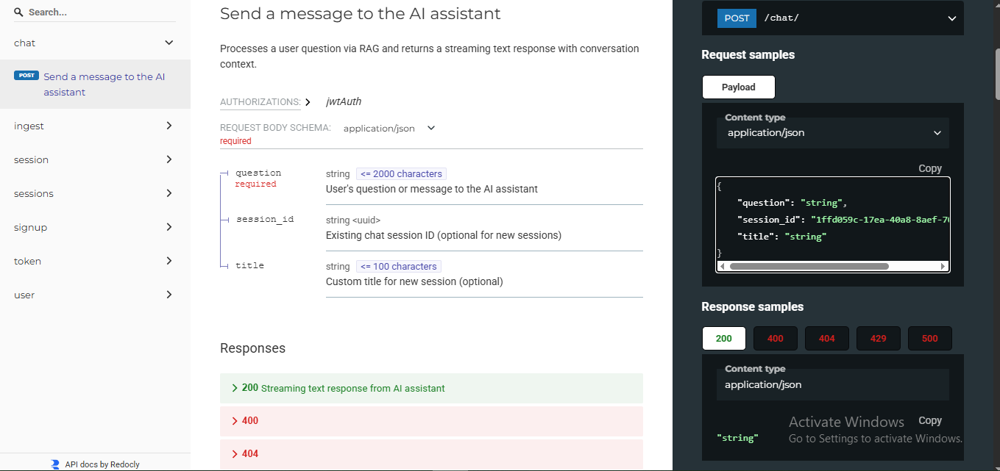
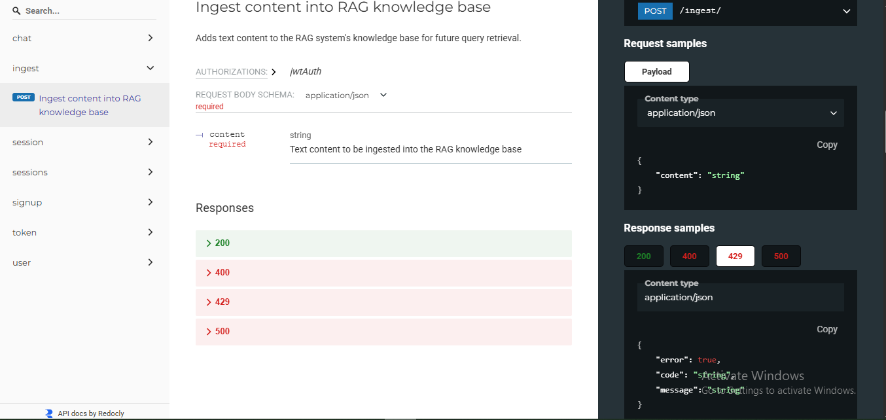
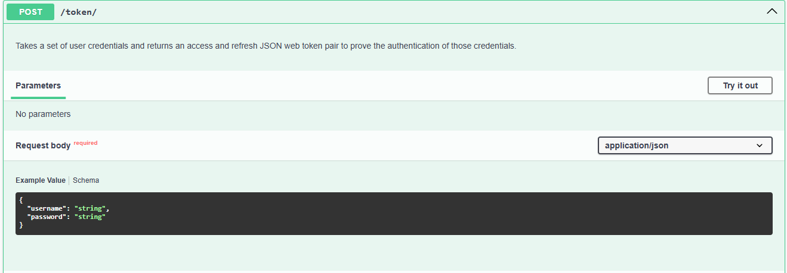
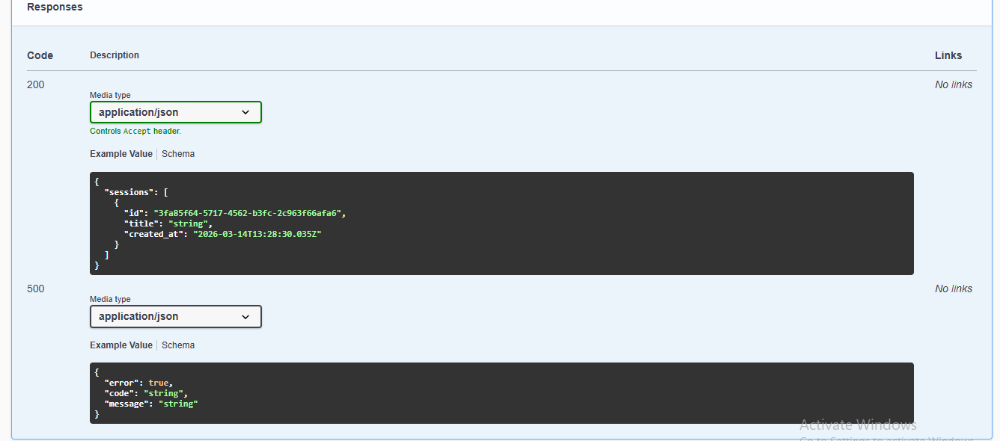
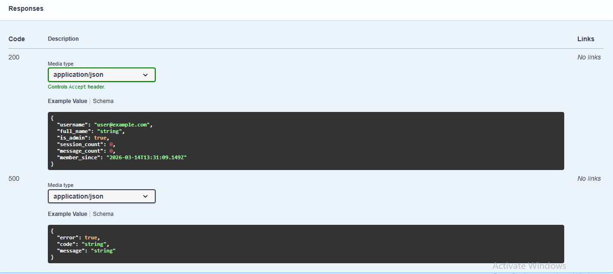

# 📸 LU AI — Screenshots

A visual walkthrough of the LU AI Chat Assistant — from the landing page to the API documentation.

---

## 🏠 Landing Page

The landing page introduces LU AI with a clean glassmorphism design. It highlights the core features of the platform and provides quick access to login or sign up.

---

## 🔐 Login

The login page uses JWT authentication via Simple JWT. Users sign in with their email and password, and on success are redirected straight into the chat interface.

---

## 💬 Chat Interface — Conversation View

The main chat interface with a collapsible sidebar showing past sessions. Users can start new conversations, switch between sessions, and see their chat history loaded instantly.

---

## 💬 Chat Interface — Streaming Response

LU AI streams responses in real time using the RAG pipeline. Chunks arrive token by token directly from the backend, giving a smooth and responsive feel to every answer.

---

## 📥 Document Ingestion

The ingestion page allows admin users to paste raw text content directly into LU's knowledge base. The content is chunked, embedded via Gemini, and stored in pgvector for future retrieval.

---

## 📄 API Docs — Chat Endpoint (ReDoc)

The `/chat/` endpoint documented via ReDoc. Shows the full request schema, streaming response format, and all possible error codes including `400`, `404`, `429`, and `500`.

---

## 📄 API Docs — Ingest Endpoint (ReDoc)

The `/ingest/` endpoint documented via ReDoc. Admin-only access with full request/response schema and error handling documentation.

---

## 🔑 API Docs — Login Endpoint (Swagger)

The `/token/` endpoint in Swagger UI. Accepts email and password, returns a JWT access token used to authenticate all subsequent requests.

---

## 📋 API Docs — Session Endpoint (Swagger)

The `/sessions/` and `/session/<id>/messages/` endpoints in Swagger UI. Returns the authenticated user's full conversation history with timestamps.

---

## 👤 API Docs — User Status Endpoint

The `/user/status/` endpoint returns the authenticated user's profile including their full name, admin status, total session count, message count, and account creation date.

---

*All API endpoints are fully explorable at `/api/docs/` (Swagger) or `/api/redoc/` (ReDoc)*

---

[← Back to README](README.md)
